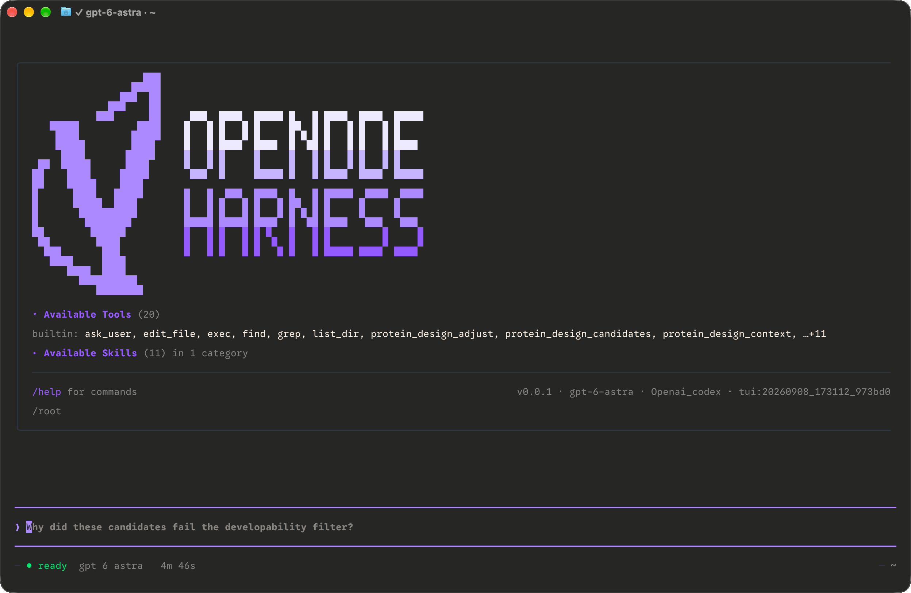
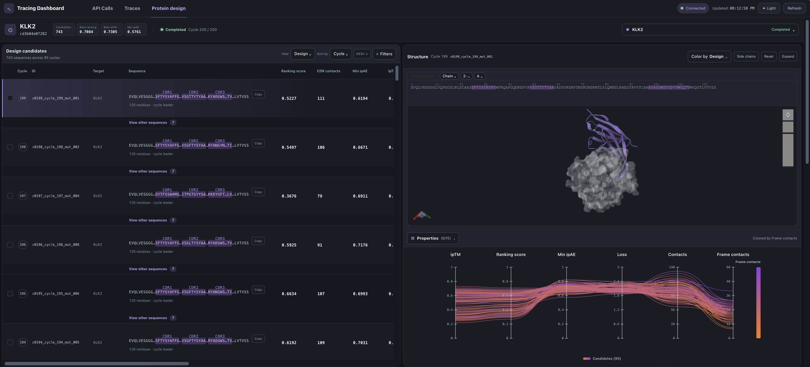
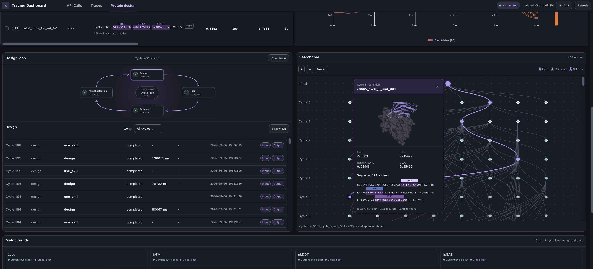
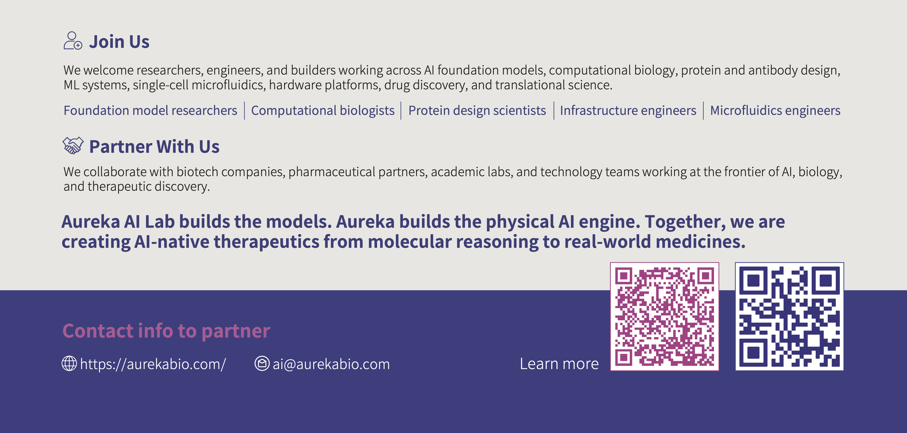

# OpenDDE Harness


[](pyproject.toml)
[](LICENSE)

[](https://pypi.org/project/opendde-harness/)




Harness for agentic antibody design: prepare targets, optimize CDR sequences, predict structures with OpenDDE, and inspect results. Supports VHH, scFv and paired VH/VL binders while preserving configured fixed residues.

- Guided setup and reviewed design plans in natural language.
- Generate antibody sequences through LLM reasoning and structural verification.
- Agentic evolutional discovery for antibody design.

> [!NOTE]
> OpenDDE Harness is an early preview, and you may encounter bugs. If something
> goes wrong, please [open an issue](https://github.com/aurekaresearch/OpenDDE-Harness/issues)
> with steps to reproduce it and your `ddeharness doctor --json` output.
> Your feedback helps us fix problems and improve the tool together.


## News

- **2026-09-09: Introducing OpenDDE Harness (preview) for agentic antibody design! Read the [technical report](docs/assets/OpenDDE_harness_tech_report.pdf).**
    - Design VHH, scFv, and paired VH/VL binders with LLM-guided sequence optimization and OpenDDE structure prediction.
    - Get started with the [installation guide](docs/installation.md), [onboarding](docs/onboarding.md), and [design examples](docs/examples/).
    - Inspect candidate sequences, structures, and design progress in the [tracing dashboard](docs/tracing-board.md).

See the [changelog](CHANGELOG.md) for release details.

## Installation

Use a Linux or macOS client with Python 3.12 or newer. Native Windows is not
currently supported. Use
[`uv`](https://docs.astral.sh/uv/getting-started/installation/) to install the
`opendde-harness` package and its `ddeharness` command in an isolated environment.
Choose one of the following methods; no environment activation is needed.

### Install from PyPI

```bash
uv tool install --python 3.12 opendde-harness
```

The release wheel includes the built terminal UI.

To update a PyPI installation, close the TUI and run:

```bash
uv tool upgrade opendde-harness
```

### Install from source

Install Git, uv, and Node.js 22 or newer with npm, then run:

```bash
git clone https://github.com/aurekaresearch/OpenDDE-Harness.git
cd OpenDDE-Harness
uv tool install --python 3.12 .
```

The package build compiles and includes the terminal UI automatically. To update,
close the TUI, preserve any local edits, and run from the checkout:

```bash
git pull --ff-only
uv tool install --python 3.12 --reinstall .
```

### After installation

After either installation, verify the client:

```bash
ddeharness --version
ddeharness --help
ddeharness tui --check
```

If the command is not found, run `uv tool update-shell` and open a new terminal.
Updates preserve configuration, results, and model data. Running compute
containers keep their current code until they exit; later starts use the updated
code. See the [installation guide](docs/installation.md) for runtime overrides,
compute environments, and model download options.

### Uninstall

Close the TUI and remove the client with:

```bash
uv tool uninstall opendde-harness
```

Configuration, results, model data, and compute services are retained.

## Quick Start

### 1. Configure the client and compute

```bash
ddeharness onboard
```

Follow the wizard to configure your LLM provider, optional memory, and a local
Docker environment or existing Linux compute service. Choose API or local OpenDDE
folding; both use the Harness compute service.

Local compute requires Linux x86-64 and Docker; CUDA also requires NVIDIA drivers
and NVIDIA Container Toolkit. See [onboarding](docs/onboarding.md) for setup and
model preparation details.

After setup, check your configuration, memory service, and compute readiness:

```bash
ddeharness doctor
```

Use `ddeharness doctor --probe` to send a test message to your LLM, or
`ddeharness doctor --compute-only` to check just the compute service. When
reporting a problem, include `ddeharness doctor --json` output and your command
or design request. See [troubleshooting](docs/troubleshooting.md) for common issues.

### 2. Start a design

Launch the terminal UI:

```bash
ddeharness
```

Then describe your task:

> Design a VHH against human CRLF2. Verify the target and epitope, keep the framework fixed, and design CDRs. Show the plan and start only after I confirm.

CLI-based design workflows are also supported. See the [CLI usage guide](docs/cli.md).

### 3. Inspect results

```bash
ddeharness tracing
```

Open the printed URL and select **Protein design** to inspect sequences, structures, metrics and agent activity.





Started design tasks run in background processes and continue after the TUI
closes while the client host remains running. Task state and worker logs default
to `~/.opendde_harness/protein_design/<task_id>/`; set
`OPENDDE_HARNESS_PROTEIN_DESIGN_ROOT` to change the task root. With remote compute,
original structure files are stored on the compute host, and the dashboard uses
structures captured in the client's tracing data. See the [dashboard guide](docs/tracing-board.md).

## Development & License

See the [repository rules](AGENTS.md) and [compute image build instructions](docker/README.md). Ordinary users consume a prebuilt image; Dockerfiles remain available for publishers and customization. Python tests live under `tests/` and run in CI with `uv run pytest`.

Licensed under [Apache-2.0](LICENSE); see [third-party notices](LICENSES/README.md). TUI and memory foundations are adapted from [Raven](https://github.com/EverMind-AI/Raven), and long-term memory is served by [EverOS](https://github.com/EverMind-AI/EverOS). Models may have separate terms.

Computational results require experimental validation. Model calls and compute may incur costs.

## Citation and Acknowledgements

If you use OpenDDE Harness in your work, please cite this software and the technical report linked above. When using OpenDDE for structure prediction, also cite the [OpenDDE technical report](https://arxiv.org/abs/2607.03787) and follow its [citation and acknowledgement guidance](https://github.com/aurekaresearch/OpenDDE#citation-and-acknowledgements). Cite the original methods for other models and tools used in your experiments, including SolubleMPNN and ESM2 when applicable.

We acknowledge [Raven](https://github.com/EverMind-AI/Raven), [EverOS](https://github.com/EverMind-AI/EverOS), and the upstream projects listed in the [third-party notices](LICENSES/README.md). Their software and model licenses continue to apply.

## Partnership and Collaboration


