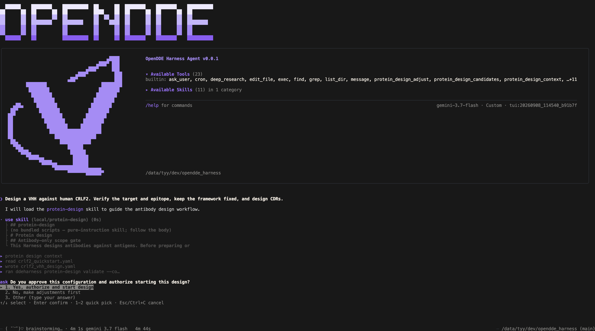

# OpenDDE Harness



Harness for agentic antibody design: prepare targets, optimize CDR sequences, predict structures with OpenDDE, and inspect results. Supports VHH, scFv and paired VH/VL binders while preserving configured fixed residues.

- Guided setup and reviewed design plans in natural language.
- Generate antibody sequences through LLM reasoning and structural verification.
- Agentic evolutional discovery for antibody design.

[Technical report ](docs/assets/OpenDDE_harness.pdf) · [Installation](docs/installation.md) · [Onboarding](docs/onboarding.md) · [Design workflow](docs/design-workflow.md) · [Examples](docs/examples/) · [Troubleshooting](docs/troubleshooting.md)

## Quick Start

### 1. Install the client

The PyPI distribution is **`opendde-harness`**; the installed command is **`ddeharness`**.
Once the release is published, install its wheel with:

```bash
uv tool install --python 3.12 opendde-harness
ddeharness --version
```

The release wheel includes the built TUI, which runs on Node.js 22+. When the client has no Node.js 22+, the first `ddeharness` run installs a private Node.js runtime under `~/.opendde_harness/runtime/` after printing a notice; set `OPENDDE_HARNESS_NODE` to use your own Node executable, or `OPENDDE_HARNESS_NO_NODE_INSTALL=1` to forbid the automatic installation.
For a source installation:

On Linux x86-64, with Git, curl and repository access:

```bash
git clone https://github.com/aurekaresearch/OpenDDE-Harness.git
cd opendde_harness
uv tool install .
```

The installer prepares uv, Python 3.12 and Node.js as needed (a source build needs Node.js with npm before the client exists, so the installer provisions it; a wheel install leaves that to the first run), builds the terminal interface, and installs the standalone `ddeharness` command. No environment activation is needed. It does not pull/start Docker or download compute models.

### 2. Prepare model assets

On the compute host, after client installation:

```bash
ddeharness onboard
```

This prepares the weights required by the configured folding mode outside the image. Without a configured mode, OpenDDE defaults to API access and only SolubleMPNN and ESM2 are prepared. Add `--mode local` to prepare OpenDDE checkpoint/common data. Onboarding can prepare these resources as part of setup.

The image contains only tool dependencies and binaries. Runtime code is prepared automatically from the installed release and pinned upstream sources, then mounted read-only. See [installation options](docs/installation.md) for custom data locations.

Local compute requires Linux x86-64 and Docker. Choose CPU or CUDA during onboarding; CUDA additionally requires compatible NVIDIA drivers and NVIDIA Container Toolkit. The same environment image serves both modes. A configured remote Linux compute service can be used without managing Docker on the client. macOS local compute is not supported.

Onboarding checks the environment contract, prepares versioned code and model assets, and starts the compute container after confirmation. From then on the container starts on demand when a task needs it and removes itself after 10 minutes idle; `ddeharness compute stop` stops it early. Onboarding never builds an image. The default tool environment is `aurekaresearch/opendde-harness:v1`; multiple Harness releases can reuse it. Code upgrades create a new directory and never modify code used by running containers.

See [onboarding](docs/onboarding.md) for local/API folding and remote services.

### 4. Start a design

In `ddeharness`, describe your task:

> Design a VHH against human CRLF2. Verify the target and epitope, keep the framework fixed, and design CDRs. Show the plan and start only after I confirm.

CLI-based design workflows are also supported. See the [CLI usage guide](docs/cli.md).

### 5. Inspect results

```bash
ddeharness tracing
```

Open the printed URL and select **Protein design** to inspect sequences, structures, metrics and agent activity.


Tasks continue after the TUI closes. Default results are stored under `~/.opendde_harness/protein_design/<task_id>/`. See the [dashboard guide](docs/tracing-board.md).

## Update or uninstall

For a PyPI installation, exit the TUI and run:

```bash
uv tool upgrade opendde-harness
```

The updated client prepares a new code snapshot when needed and reuses a compatible
tool environment. A running compute container keeps its original code until it exits when idle; the next start uses the new snapshot.

Exit the TUI and preserve local edits before updating the source installation:

```bash
git pull --ff-only
sh install.sh
```

This updates the client without changing configuration or a running container. Compute image updates are separate; the next container start uses the selected image.

To remove only the client:

```bash
uv tool uninstall opendde-harness
```

Configuration, results, model data and compute services are retained. See [installation](docs/installation.md#update-and-uninstall).

## Architecture & Structure

The Python client runs agents and task orchestration; the Node.js terminal UI is its frontend. An on-demand Docker service runs scientific operations and exits when idle. The browser tracing board displays task state and results.

```text
opendde_harness/
  agent/                     Agent runtime
  cli/                       CLI and onboarding
  config/                    Configuration models and updates
  context_engine/            Context assembly
  memory_engine/             Memory subsystems and SkillForge skills
  plugin/memory/             Long-term memory backend
  plugin/protein_design/     Workflow, task tools and compute API
  providers/                 LLM integrations
  sandbox/                   Command execution for the exec tool
  security/                  Network and untrusted-content guards
  session/                   Conversation sessions
  spine/                     Turn scheduling backbone
  templates/                 Workspace file templates
  token_wise/                Token accounting around LLM calls
  tracing/                   Traces and browser dashboard
  tui_rpc/                   Terminal UI communication
  utils/                     Shared helpers
ui-tui/                      Terminal frontend
docker/                      Maintainer-only image build files and checks
docs/                        User and developer guides
tests/                       Automated tests
```

## Development & License

See the [repository rules](AGENTS.md) and [compute image build instructions](docker/README.md). Ordinary users consume a prebuilt image; Dockerfiles remain available for publishers and customization. Python tests live under `tests/` and run in CI with `uv run pytest`.

Licensed under [Apache-2.0](LICENSE); see [third-party notices](LICENSES/README.md). TUI and memory foundations are adapted from [Raven](https://github.com/EverMind-AI/Raven), and long-term memory is served by [EverOS](https://github.com/EverMind-AI/EverOS). Models may have separate terms.

Computational results require experimental validation. Model calls and compute may incur costs.

## Partnership and Collaboration


